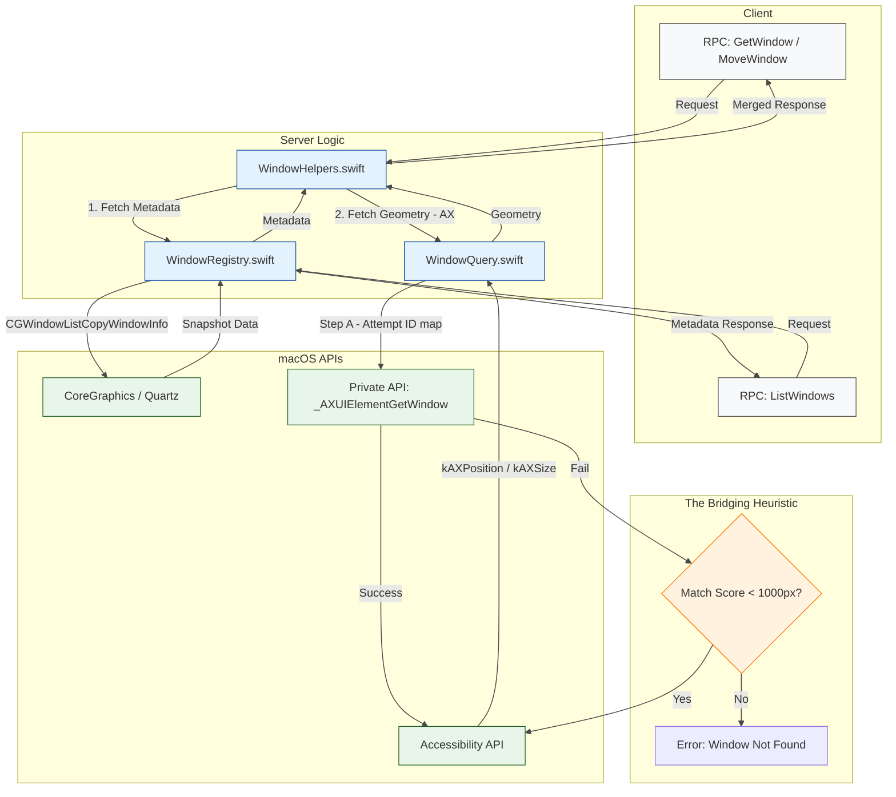
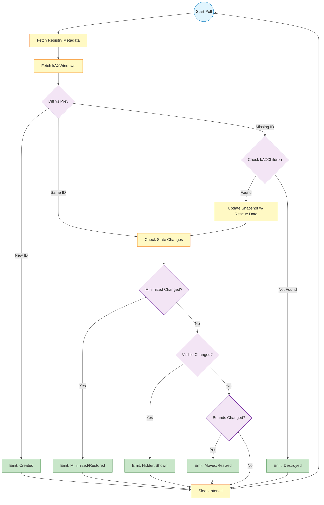

# Window State Management: Architecture, Hybrid Authority, and Implementation

**Status:** Living Document
**Context:** MacosUseSDK Window Management Subsystem
**Relevant Files:** `proto/macosusesdk/v1/window.proto`, `Sources/MacosUseSDK/WindowQuery.swift`, `Server/Sources/MacosUseServer/WindowRegistry.swift`, `Server/Sources/MacosUseServer/WindowHelpers.swift`, `Server/Sources/MacosUseServer/ObservationManager.swift`, `Server/Sources/MacosUseServer/WindowMethods.swift`

-----

## 1\. Executive Summary and Problem Space

Window state management on macOS is a "split-brain" problem. The operating system provides two distinct, non-interoperable APIs for window data, neither of which is sufficient on its own:

1.  **Quartz Window Services (CoreGraphics):** A global, high-performance, read-only view of the compositor's display list. It provides stable IDs (`CGWindowID`) and metadata but suffers from data staleness (10-100ms latency) and cannot manipulate windows.
2.  **Accessibility API (AX):** A process-specific, heavy, synchronous IPC interface used for fine-grained state inspection and manipulation (Geometry, Visibility). It is authoritative for current state but lacks stable identifiers and cannot see windows on background spaces.

**MacosUseSDK implements a "Hybrid Authority" model.** We do not attempt to abstract away this duality completely. Instead, we explicitly assign authority for specific data fields to specific APIs based on the nature of the RPC (Read-only Enumeration vs. Mutation/Inspection).

This document serves as the definitive reference for this architecture, the bridging logic, race-condition mitigations, and the specific heuristics used to reconcile the two systems.

-----

## 2\. The Hybrid Authority Model

The core architectural tenet is that **Accessibility (AX) is the single source of truth for geometry and fine-grained state**, while **Quartz (Registry) is the single source of truth for metadata and enumeration.**

This distinction is codified in the API implementation as follows:

### 2.1 Authority Matrix

| Data Field / Behavior | Authority Source | Implementation Detail |
| :--- | :--- | :--- |
| **Enumeration** (List of Windows) | **Quartz** | `CGWindowListCopyWindowInfo` via `WindowRegistry`. **$O(1)$** latency relative to window count. |
| **Identity** (Window ID) | **Quartz** | `CGWindowID`. |
| **Geometry** (Position, Size) | **AX** | `kAXPosition`, `kAXSize` via `WindowQuery`. **$O(N)$** latency. |
| **Visibility** | **Hybrid** | Formula: `!axMinimized && !axHidden`. Overrides Registry `isOnScreen`. |
| **Z-Order / Layer** | **Quartz** | `kCGWindowLayer` via `WindowRegistry`. |
| **Bundle ID** | **Quartz** | `kCGWindowOwnerPID` resolved to Bundle ID via `WindowRegistry`. |
| **State Details** (Modal, Focused) | **AX** | `kAXModalAttribute`, `kAXMainAttribute`. |

### 2.2 The RPC Split

To balance performance with correctness, the gRPC surface enforces different behaviors for different calls:

  * **`ListWindows` (Registry-Only):** Optimized for high-frequency polling and UI rendering. It returns a snapshot from the `WindowRegistry`. It **does not** perform per-window AX queries.
      * *Tradeoff:* Geometry and visibility may lag by \~50ms during animations. Windows on background spaces may report `visible=false` even if technically open.
  * **`GetWindow` / Mutations (AX-Authoritative):** Optimized for correctness. It fetches a fresh AX snapshot to ensure that a window moved via RPC is reported at its *exact* new location immediately, ignoring the stale Quartz cache.

-----

## 3\. Data Flow and Architecture

The following diagram illustrates the critical "Split-Brain" resolution path. Note how `GetWindow` merges data from two distinct subsystems, while `ListWindows` bypasses the expensive AX layer entirely.



### 3.1 Component Responsibilities

1.  **`Server/Sources/MacosUseServer/WindowRegistry.swift`**:

      * Maintains a cached list of windows using `CGWindowListCopyWindowInfo` with options `[.optionAll, .excludeDesktopElements]`.
      * Refreshes on demand or periodically.
      * **Constraint:** Never blocks on AX IPC calls.

2.  **`Sources/MacosUseSDK/WindowQuery.swift`**:

      * Contains the bridging logic (`fetchAXWindowInfo`).
      * Executes the "Private API first, Heuristic second" strategy.
      * **Constraint:** Must run in `Task.detached` to avoid blocking the Main Actor.

3.  **`Server/Sources/MacosUseServer/WindowHelpers.swift`**:

      * Orchestrates the response assembly.
      * Implements the Visibility Logic formula.
      * **Constraint:** Executes AX attribute fetching in a `Task.detached` context.

-----

## 4\. The Bridging Implementation (Quartz ↔ AX)

There is no public API to convert a `CGWindowID` (Quartz) to an `AXUIElement` (AX). This is the "Extremely Difficult Problem." We solve this via a two-tier strategy implemented in `Sources/MacosUseSDK/WindowQuery.swift`.

### 4.1 Tier 1: Private API (Gold Standard)

We resolve the private symbol at runtime via `dlsym`:

```swift
typealias AXUIElementGetWindowFunc = @convention(c) (AXUIElement, UnsafeMutablePointer<CGWindowID>) -> AXError

let handle = dlopen(nil, RTLD_LAZY)
let sym = dlsym(handle, "_AXUIElementGetWindow")
```

If `dlsym` returns a non-nil pointer, we cast it to the expected function signature and call it on candidate AX elements. If it returns a `CGWindowID` matching our target, we have a deterministic 1:1 match. This is preferred 100% of the time.

**Graceful degradation:** Unlike `@_silgen_name` (which would crash at launch if the symbol were absent), the `dlsym` approach gracefully returns `nil` when the private symbol is unavailable — for example, if Apple removes it in a future macOS version. In that case, the code silently falls back to Tier 2 heuristic matching with no user-visible error.

### 4.2 Tier 2: The "1000px Heuristic"

If the private API fails (SIP restrictions or OS changes), we fall back to geometric comparison.

1.  We fetch the target window's `bounds` from Quartz.
2.  We iterate over the application's AX windows.
3.  We calculate a score using Euclidean distance via `hypot()`: `hypot(AX.x - Quartz.x, AX.y - Quartz.y) + hypot(AX.width - Quartz.width, AX.height - Quartz.height)`.
4.  **The Threshold:** We accept a match only if the score is **\< 1000.0**.
5.  **Single-Window Fallback:** When only one AX window exists for the PID, the match is accepted regardless of score, bypassing the 1000px threshold. A single window cannot be ambiguous.

#### Heuristic Fairness, Biases, and Analysis

The geometry-based matching heuristic is intentionally pragmatic but not neutral. There are two sources of systemic bias and specific strategies used to compensate for them:

  * **Shadow Penalty:** Quartz often reports bounds that include drop-shadows and invisible resize handles, while Accessibility (AX) tends to report the content bounds. This permanent delta systematically increases the geometric distance score for applications that draw custom chrome (Electron, webviews, custom frames). The heuristic tolerates this via the threshold so native and custom-window apps are treated comparably.
  * **Animation Lag:** The compositor (Quartz) and the AX subsystem can be temporarily out-of-sync while a window is moving. The compositor typically leads and AX follows; this can produce transient origin deltas of a few hundred pixels during fast drags.

**Why `1000.0`?** The chosen `1000.0` pixel threshold is a conservative compromise:

  * It comfortably absorbs common shadow penalties and animation-lag deltas observed in practice (tens to several hundreds of pixels).
  * It prevents matching across large discontinuities (for example an inter-monitor jump of several thousand pixels), which would be a dangerous false positive.
  * **Fail-Closed Behavior:** Immediately after very large cross-monitor moves (e.g., \>1200px) in the rare case where `_AXUIElementGetWindow` fails, `GetWindow` may temporarily return `NOT_FOUND` until the Quartz and AX views converge. This is accepted as a *fail-closed* tradeoff to avoid misidentifying another window.

Realistic examples observed in implementation:

  * **Stacked clones:** Two identical windows offset by \~20px produce very small scores (≈28 via `hypot(20,20)`). The heuristic easily picks the intended window.
  * **Electron shadow / custom chrome:** AX content (1000×800) vs CG bounds (1020×820) gives scores ∼28–30 (`hypot(20,20) + hypot(0,0)`) — well under 1000.
  * **Multi-monitor jump:** Moving a window from x=0 to x=3840 yields scores ≫1000; that correctly rejects the match to avoid cross-monitor false matches.

-----

## 5\. Visibility and State Semantics

Visibility is calculated differently depending on the context. This is a deliberate architectural choice to handle the "Background Space" problem.

### 5.1 The Visibility Formula (AX-First Optimistic)

For `GetWindow` and Event Observation, visibility is calculated as:

```swift
// Code reference: WindowHelpers.swift
let isOnScreen = (!axMinimized && !axHidden) ? true : (metadata?.isOnScreen ?? false)
let visible = isOnScreen && !axMinimized && !axHidden
```

Algebraically, this simplifies to:
$$visible = \neg axMinimized \land \neg axHidden$$

  * **Note:** We technically fall back to Quartz `isOnScreen` if AX fails, but in practice, if we have an AX handle, the formula above is authoritative.
  * This ensures that if a user sets `visible=true`, the system reports it as true immediately, even if the Quartz registry is stale.

### 5.2 The "Background Space Visibility" Caveat

  * **Scenario:** A window is on Space 2. The user is on Space 1.
  * **Quartz (`ListWindows`):** May report `visible=true` or `visible=false` depending on occlusion and complex OS logic.
  * **AX (`GetWindow`):** Will likely fail to find the window entirely (AX `kAXWindows` only lists the active space).
  * **Result:** It is possible for `ListWindows` to list a window that `GetWindow` subsequently fails to retrieve. This is a documented limitation of the macOS API surface.

-----

## 6\. Observation Logic and Race Condition Mitigation

The `ObservationManager` (`Server/Sources/MacosUseServer/ObservationManager.swift`) is responsible for detecting changes. It must handle the "Orphan" race condition: when a window is transitioning (e.g., minimizing), it may briefly disappear from `kAXWindows` before reappearing with the `minimized` property set.

### 6.1 Orphan Rescue Strategy

1.  Snapshot current `kAXWindows`.
2.  Identify windows present in the *previous* snapshot but missing in the *current*.
3.  **Rescue:** Query `kAXChildren` explicitly. The OS often moves transitioning windows to the generic children list temporarily.
4.  If found in `kAXChildren`, update the snapshot. If still missing, mark as `Destroyed`.

### 6.2 State Transition Logic (`Cmd+H` vs `Cmd+M`)

We strictly distinguish between Hidden and Minimized:

  * **Minimized (`Cmd+M`):** `kAXMinimized == true`.
  * **Hidden (`Cmd+H`):** `kAXHidden == true`.
  * **Observation Event Rule:** A `.hidden` event is **only** emitted if `visible` becomes false AND `minimized` remains false. This prevents minimize actions from firing duplicate "hidden" events.

### 6.3 Observation Loop Visualization



### 6.4 Window ID Regeneration After Mutations

**Critical macOS Behavior:** After certain window mutations, the `CGWindowID` may appear to change. This is frequently observed in non-native applications (e.g., Electron) or when Accessibility references become stale. To handle this instability, we treat the Window ID as ephemeral.

**Symptoms:**
- A `MoveWindow` RPC succeeds, but the old window ID becomes invalid.
- Subsequent `GetWindow` calls with the old ID fail with "not found".
- Observations may emit `Destroyed` followed by `Created` events for the same logical window.

**Mitigations Implemented:**
1. **Single-Window Fallback:** If a PID has exactly one window, accept it regardless of ID mismatch (Windows can't be ambiguous if there's only one).
2. **Bounds-Based Matching:** When ID lookup fails, fall back to heuristic matching using expected geometry.
3. **Response Name Update:** Mutation RPCs return the *current* window name (which includes the new ID if regenerated), not the original request name.
4. **Position-Based Rediscovery:** In tests and client code, use position-based window discovery after mutations rather than relying on cached window IDs.

**Test Implications:**
- Tests should accept `Destroyed`/`Created` event pairs as valid alternatives to `Moved` events when ID regeneration occurs.
- Tests should use fresh `ListWindows` calls to rediscover window names after geometry mutations.

-----

## 7\. Alternatives Considered

During the architectural design, several alternative models were evaluated and discarded:

### 7.1 Registry-Only Visibility (Discarded)

An alternative design would have treated `Window.visible` as purely registry-derived (`kCGWindowIsOnscreen`) across all RPCs.

  * **Pros:** Single source of truth; no AX/Quartz divergence; simpler mental model.
  * **Cons:** `CGWindowList` can lag 10–100ms behind AX after mutations. This causes `MoveWindow` / `ResizeWindow` RPCs to report `visible=false` immediately after success, even though the window is clearly visible. It also leads to observation flip-flops where a window is rapidly reported as hidden/visible due to registry catch-up.
  * **Decision:** Rejected in favor of AX-first `GetWindow` precisely to guarantee post-mutation correctness.

### 7.2 AX-Only Enumeration (Discarded)

Another extreme would have been to use AX alone for enumeration (e.g., `ListWindows` reading only `kAXWindows`).

  * **Pros:** Perfect alignment between visibility semantics and AX state.
  * **Cons:** AX lacks a global view of all windows (background Spaces, minimized windows, some non-standard apps). AX enumeration is significantly slower and blocked by target app responsiveness. It would require per-window AX calls for z-index and positioning, harming scalability.
  * **Decision:** The current Hybrid Registry+AX approach is a middle ground: Quartz for global, cheap metadata; AX for per-window detailed state.

### 7.3 Global Bipartite Matching (Deferred)

A more mathematically rigorous mapping between CG and AX windows via a **Hungarian algorithm** over a cost matrix of geometry distances was considered.

  * **Pros:** Provides a stable, global mapping between all CG windows and all AX windows for a PID. Resolves ambiguous “stacked clone” scenarios better than greedy heuristics.
  * **Cons:** Significantly more complex to implement and maintain. Requires maintaining a global mapping state, complicating cache invalidation. The benefit over the current scheme is marginal for typical per-window operations where $O(N)$ is small.
  * **Decision:** The implementation opts for greedy per-window matching with `_AXUIElementGetWindow` as the primary authority.

-----

## 8\. Implementation Checklist & Critical Details

When modifying this subsystem, strictly adhere to the following constraints derived from the `docs/03-actual-window-state-management-impl.md` analysis:

  * **File:** `Server/Sources/MacosUseServer/WindowHelpers.swift`

      * [ ] **Constraint:** `buildWindowResponseFromAX` must always use `Task.detached` to prevent Main Actor blocking during expensive IPC calls.
      * [ ] **Constraint:** Visibility logic must remain `!axMinimized && !axHidden` for `GetWindow` responses.

  * **File:** `Sources/MacosUseSDK/WindowQuery.swift`

      * [ ] **Constraint:** `fetchAXWindowInfo` must implement the `_AXUIElementGetWindow` private call.
      * [ ] **Constraint:** The fallback heuristic must remain at `1000.0`. Do not lower this without extensive regression testing on multi-monitor setups.
      * [ ] **Constraint:** **Must** attempt `kAXChildrenAttribute` if `kAXWindowsAttribute` is empty to handle orphans.

  * **File:** `Server/Sources/MacosUseServer/WindowMethods.swift`

      * [ ] **Constraint:** MinimizeWindow and RestoreWindow must implement a **PollUntil** pattern (typically 2.0s timeout) to verify the state change via AX before returning success. MoveWindow and ResizeWindow set the AX attribute and immediately query fresh AX state to return accurate geometry — they do not poll.
      * [ ] **Constraint:** **Must** call `windowRegistry.invalidate(windowID:)` immediately after any mutation to prevent stale reads on subsequent calls.

  * **File:** `Server/Sources/MacosUseServer/WindowRegistry.swift`

      * [ ] **Constraint:** **Must** use `[.optionAll, .excludeDesktopElements]` to ensure off-screen windows are tracked.

## 9\. Conclusion

This implementation accepts the reality of macOS's fractured windowing APIs. By using Quartz for the broad view and AX for the detailed view—and bridging them with rigorous heuristics and private APIs—we achieve a system that is performant for enumeration yet correct for manipulation. Any deviation from the "Hybrid Authority" model described here risks re-introducing the split-brain state inconsistencies this architecture was designed to solve.
