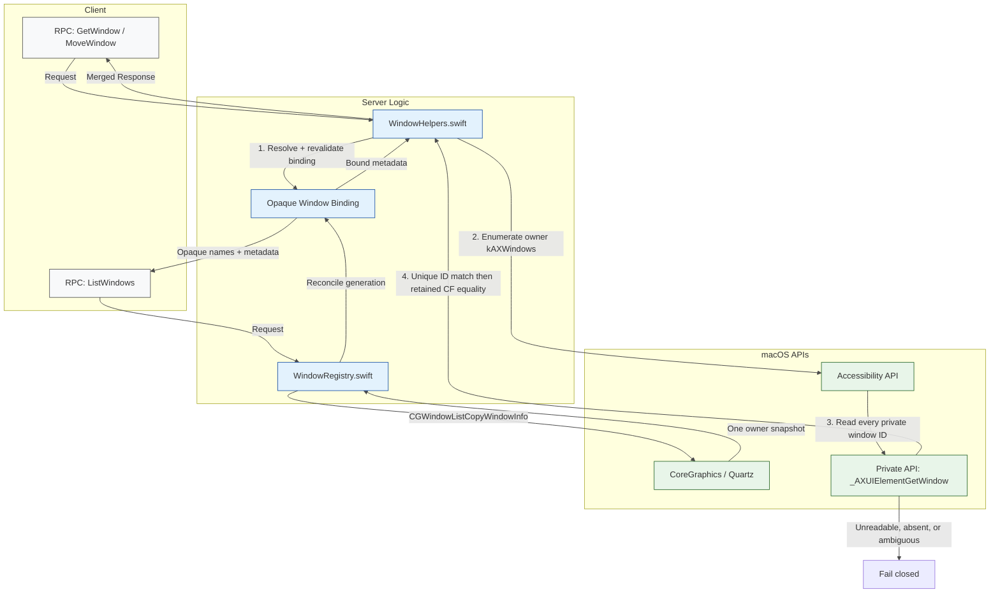
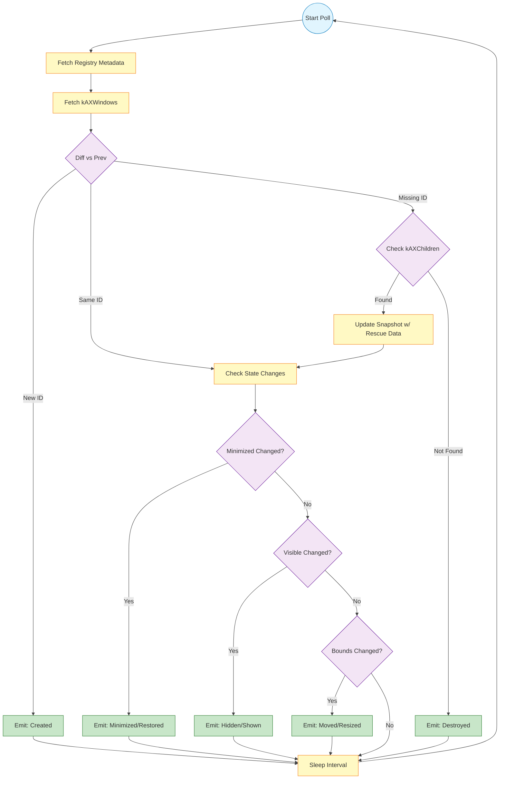

# Window State Management: Opaque Identity, Hybrid Authority, and Convergence

**Status:** Living Document
**Context:** ExactMac Window Management Subsystem
**Relevant Files:** `proto/exactmac/v1/window.proto`, `Server/Sources/ExactMacServer/WindowRegistry.swift`, `Server/Sources/ExactMacServer/WindowHelpers.swift`, `Server/Sources/ExactMacServer/ObservationManager.swift`, `Server/Sources/ExactMacServer/WindowMethods.swift`

-----

## 1\. Executive Summary and Problem Space

Window state management on macOS is a "split-brain" problem. The operating system provides two distinct, non-interoperable APIs for window data, neither of which is sufficient on its own:

1.  **Quartz Window Services (CoreGraphics):** A global, read-only snapshot of the compositor's display list. It provides snapshot-local IDs (`CGWindowID`) and metadata, but snapshots may be stale and cannot manipulate windows. A CG ID is not a public resource identity and may be reused after disappearance.
2.  **Accessibility API (AX):** A process-specific, synchronous IPC interface used for fine-grained state inspection and manipulation (Geometry, Visibility). It is authoritative for reads of an admitted element but lacks stable public identifiers and may fail to enumerate windows outside the active Space.

**ExactMac implements a "Hybrid Authority" model.** We do not attempt to abstract away this duality completely. Instead, we explicitly assign authority for specific data fields to specific APIs based on the nature of the RPC (Read-only Enumeration vs. Mutation/Inspection).

This document is the reference for this architecture, the opaque public binding model, race-condition mitigations, and the fail-closed bridging logic used to reconcile the two systems.

-----

## 2\. The Hybrid Authority Model

The core architectural tenet is that **Accessibility (AX) is the single source of truth for geometry and fine-grained state**, while **Quartz (Registry) is the single source of truth for metadata and enumeration.**

This distinction is codified in the API implementation as follows:

### 2.1 Authority Matrix

| Data Field / Behavior | Authority Source | Implementation Detail |
| :--- | :--- | :--- |
| **Enumeration** (List of Windows) | **Quartz** | `CGWindowListCopyWindowInfo` via `WindowRegistry`; one snapshot call followed by parsing of the returned rows. |
| **Public identity** | **WindowRegistry binding** | Server-issued opaque resource ID scoped to an exact application resource, PID, and kernel process identity. A `CGWindowID` is binding metadata, never the public name. |
| **Geometry** (Position, Size) | **AX** | `kAXPosition` and `kAXSize` from the exact retained `kAXWindows` element. |
| **List visibility** | **Quartz** | `kCGWindowIsOnscreen` from the same enumeration snapshot. |
| **Get visibility** | **Quartz + AX** | The admitted Quartz row must be on-screen and fresh AX state must report neither a minimized window nor hidden owner. |
| **Compositing layer** | **Quartz** | `kCGWindowLayer` via `WindowRegistry`; this is not front-to-back z-order. |
| **Bundle ID** | **Quartz** | `kCGWindowOwnerPID` resolved to Bundle ID via `WindowRegistry`. |
| **State Details** (Modal, Focused) | **AX** | `kAXModalAttribute`, `kAXMainAttribute`. |

### 2.2 The RPC Split

To balance performance with correctness, the gRPC surface enforces different behaviors for different calls:

  * **`ListWindows` (Registry-Only):** Optimized for high-frequency polling and UI rendering. It returns a snapshot from the `WindowRegistry`. It **does not** perform per-window AX queries.
      * *Tradeoff:* Snapshot metadata may be stale during animations. Windows on background spaces may report `visible=false` even if technically open.
  * **`GetWindow` / Mutations (AX-Authoritative):** Resolve an existing opaque binding, revalidate its exact owner before and after AX reads, and fail closed on stale, replaced, cross-owner, or ambiguous targets. Mutations hold the physical-desktop lease until cancellation-aware polling observes the requested state (including stable macOS clamping) or returns a precise timeout.

-----

## 3\. Data Flow and Architecture

The following diagram illustrates the critical "Split-Brain" resolution path. Note how `GetWindow` merges data from two distinct subsystems, while `ListWindows` bypasses the expensive AX layer entirely.



### 3.1 Component Responsibilities

1.  **`Server/Sources/ExactMacServer/WindowRegistry.swift`**:

      * Reads exactly one `CGWindowListCopyWindowInfo` snapshot per owner enumeration using options `[.optionAll, .excludeDesktopElements]`.
      * Reconciles that snapshot into server-issued, generation-scoped public bindings and retires missing or replaced-owner bindings immediately.
      * Preserves an opaque public name when the same already-admitted AX element reports a changed CG ID; a later reuse of a retired CG ID receives a different public name.
      * **Constraint:** Never blocks on AX IPC calls.

2.  **`Server/Sources/ExactMacServer/WindowHelpers.swift`**:

      * Orchestrates exact-owner resolution, response assembly, mutation convergence, and cancellation.
      * Preserves AX error codes and type failures instead of flattening them into false/default state. Only explicitly optional absence (`kAXErrorAttributeUnsupported` or `kAXErrorNoValue`) receives the documented default.
      * Performs structured reads and owner revalidation; no detached lookup is allowed to outlive caller cancellation.

-----

## 4\. Bound-Target Resolution (Quartz ↔ AX)

There is no public API to convert a `CGWindowID` (Quartz) to an
`AXUIElement` (AX). Public callers never select by CG ID: they present an
existing opaque binding, which fixes the application resource, PID, kernel
process identity, and last observed CG metadata.

### 4.1 Exact Initial Admission

The server enumerates only the exact owner's `kAXWindows` collection. Every
candidate must expose a readable window role, private window ID, and
endpoint-safe frame. Initial admission requires exactly one candidate whose
private ID equals the binding's CG ID. An unavailable private symbol,
unreadable candidate, duplicate ID, or missing match fails the request.

### 4.2 Retained Identity

After initial admission, the retained AX CF object is authoritative. Each later
read or mutation must find that same object in the owner's `kAXWindows`
collection. A different AX object cannot inherit the public name even if it
reuses the same private ID. A private ID change is accepted only for the same
retained object and is committed atomically with its observed frame.

-----

## 5\. Visibility and State Semantics

Visibility is calculated differently depending on the context. This is a deliberate architectural choice to handle the "Background Space" problem.

### 5.1 The Visibility Formula

For `GetWindow`, visibility is calculated as:

```swift
// Code reference: WindowHelpers.swift
let visible = admittedCGWindowIsOnScreen &&
    !windowMinimized &&
    !ownerApplicationHidden
```

Algebraically, this simplifies to:
$$visible = cgOnScreen \land \neg windowMinimized \land \neg ownerApplicationHidden$$

  * `kAXMinimized` is read from the exact window. `kAXHidden` is application-specific and is read from the exact owner application.
  * Required geometry and state reads preserve AX failures and wrong types. Optional title/minimized/hidden/subrole/button absence defaults only for `kAXErrorAttributeUnsupported` or `kAXErrorNoValue`; transient failure is not reported as a legitimate `false` or empty value.
  * `GetWindowState.resizable` comes from `AXUIElementIsAttributeSettable(kAXSizeAttribute)`. `modal` and `focused` require boolean AX values; dialog and floating classification uses exact documented subrole equality, never substring matching.
  * `ListWindows` remains registry-only and reports `kCGWindowIsOnscreen` from its one enumeration snapshot. `GetWindow` combines that admitted value with fresh AX minimized/hidden state.

### 5.2 The "Background Space Visibility" Caveat

  * **Scenario:** A window is on Space 2. The user is on Space 1.
  * **Quartz (`ListWindows`):** May report `visible=true` or `visible=false` depending on occlusion and complex OS logic.
  * **AX (`GetWindow`):** Will likely fail to find the window entirely (AX `kAXWindows` only lists the active space).
  * **Result:** It is possible for `ListWindows` to list a window that `GetWindow` subsequently fails to retrieve. This is a documented limitation of the macOS API surface.

-----

## 6\. Observation Logic and Race Condition Mitigation

The `ObservationManager` (`Server/Sources/ExactMacServer/ObservationManager.swift`) is responsible for detecting changes. It must handle the "Orphan" race condition: when a window is transitioning (e.g., minimizing), it may briefly disappear from `kAXWindows` before reappearing with the `minimized` property set.

### 6.1 Orphan Rescue Strategy

1.  Snapshot current `kAXWindows`.
2.  Identify windows present in the *previous* snapshot but missing in the *current*.
3.  **Rescue:** Query `kAXChildren` explicitly, then use an on-screen CG row or the previous snapshot as applicable during transient mutations.
4.  If all rescue paths fail, emit the destroyed transition for that observation cycle; this is a policy conclusion, not proof of permanent destruction.

### 6.2 State Transition Logic (`Cmd+H` vs `Cmd+M`)

We strictly distinguish between Hidden and Minimized:

  * **Minimized (`Cmd+M`):** `kAXMinimized == true`.
  * **Hidden (`Cmd+H`):** `kAXHidden == true`.
  * **Observation Event Rule:** A `.hidden` event is **only** emitted if `visible` becomes false AND `minimized` remains false. This prevents minimize actions from firing duplicate "hidden" events.

### 6.3 Observation Loop Visualization



### 6.4 Underlying CG ID Changes After Mutations

**Critical macOS Behavior:** After certain window mutations, the underlying `CGWindowID` may change. ExactMac treats that number as ephemeral metadata, not as public identity.

**Symptoms:**
- A mutation resolves the already-admitted AX element, but that element now reports a different CG ID.
- A retired CG ID can later be reused for a different window generation.
- The owner application can be replaced while retaining the same PID, making all bindings for the old kernel process identity stale.

**Mitigations Implemented:**
1. **Opaque generation binding:** The public name is a server-issued UUID scoped to the exact application resource and kernel process identity.
2. **Stable logical identity:** If the same admitted AX element reports a new CG ID, `WindowRegistry` moves that binding to the new metadata while preserving the public name.
3. **Immediate retirement:** An owner enumeration retires every missing binding. Closing a window retires its binding only after AX disappearance is observed.
4. **No reuse:** A later window using the same CG ID receives a fresh public name; the retired name remains stale.
5. **Fail-closed ambiguity:** Known-ID mismatch, cross-owner access, process replacement, or an already-bound target CG ID returns an error rather than rewriting the binding.

**Test Implications:**
- Generated-client tests retain the same public window name across an admitted element's CG-ID change.
- Tests require a distinct public name after disappearance plus CG-ID reuse and require the old name to remain `NOT_FOUND`.
- Mutation tests poll the same resource until the requested AX state is stably observed; they do not rediscover by position or accept status-only success.

-----

## 7\. Alternatives Considered

During the architectural design, several alternative models were evaluated and discarded:

### 7.1 Registry-Only Visibility (Discarded)

`GetWindow` never fabricates visibility from AX state alone. A window that the
admitted Quartz snapshot reports off-screen remains `visible=false`, even when
it is neither minimized nor owned by a hidden application.

### 7.2 AX-Only Enumeration (Discarded)

Another extreme would have been to use AX alone for enumeration (e.g., `ListWindows` reading only `kAXWindows`).

  * **Pros:** Perfect alignment between visibility semantics and AX state.
  * **Cons:** AX lacks a global view of all windows (background Spaces, minimized windows, some non-standard apps). AX enumeration is significantly slower and blocked by target app responsiveness. It cannot provide a truthful global compositing-layer inventory.
  * **Decision:** The current Hybrid Registry+AX approach is a middle ground: Quartz for global, cheap metadata; AX for per-window detailed state.

### 7.3 Geometry-Based Identity Matching (Rejected)

Geometry and title scoring can silently transfer a public identity to a
different window.

  * **Decision:** The server admits one unique private window-ID match from the
    owner's `kAXWindows` collection and thereafter requires exact retained CF
    identity. Ambiguous or unreadable candidates fail closed.

-----

## 8\. Passive Observation and the Activation Cycle

### 8.1 The Activation Cycle Problem

macOS sends `NSWorkspace.didActivateApplicationNotification` and `didDeactivateApplicationNotification` whenever an application gains or loses focus. Prior to the passive-observation fix, `traverseAccessibilityTree` unconditionally called `NSRunningApplication.activate()` before every traversal. This created a destructive feedback loop:

1.  The `ObservationManager` polls `traverseAccessibilityTree` on a timer.
2.  Each poll calls `app.activate()`, bringing the target app to the foreground.
3.  macOS fires `didActivateApplication` for the target, `didDeactivateApplication` for the previously active app.
4.  The `ChangeDetector` receives these notifications for logging and circuit-breaker handling; it does not publish them as current observation events.
5.  In the historical failure mode, the observation loop re-fired, starting another poll → another `activate()` call → more notifications.

This cycle causes **focus stealing** (the user's foreground app keeps losing focus) and **notification storms** (hundreds of activation events per second).

### 8.2 Passive Observation Mode (Default)

The `traverseAccessibilityTree` function accepts a `shouldActivate` parameter that defaults to `false`:

```swift
public func traverseAccessibilityTree(
    pid: Int32,
    onlyVisibleElements: Bool = false,
    shouldActivate: Bool = false
) throws -> ResponseData
```

When `shouldActivate` is `false` (the default), **no `app.activate()` call is made**. AX APIs return fresh data without requiring the target app to be in the foreground. This is the mode used by `ObservationManager` for all polling:

```swift
// ObservationManager.swift — explicit shouldActivate: false
let result = try await AutomationCoordinator.shared.handleTraverse(
    pid: pid, visibleOnly: filter.visibleOnly, shouldActivate: false
)
```

### 8.3 When `shouldActivate: true` Is Needed

Set `shouldActivate: true` only when the caller explicitly intends to bring the app to the foreground — i.e., the activation is a deliberate user action, not an internal polling side-effect. Examples:

| Scenario | `shouldActivate` |
| :--- | :--- |
| Observation polling (background) | `false` |
| Accessibility tree traversal (background tool call) | `false` |
| Interactive element action requiring foreground | `true` (via caller) |

> **Note:** Observation requests can pass `activation: true`, which reaches
> `handleTraverse` and activates the target. The current path does not call
> `markSDKActivation`, so those workspace notifications are not suppressed by
> the self-activation tracker. Background observation remains passive by default.

### 8.4 Circuit Breaker in ChangeDetector

Even with passive observation, external events or edge cases could trigger rapid activation storms. The `ChangeDetector` implements a per-PID circuit breaker to cap activation event throughput:

- **Threshold:** 5 activation events per PID within a 1-second rolling window.
- **Behavior:** When the threshold is exceeded, further activation/deactivation events for that PID are silently suppressed until the window expires.
- **Reset:** The rolling window resets on the next event after the window has elapsed.

The circuit breaker operates in `shouldCircuitBreak(pid:)` and is checked in both `handleAppActivated` and `handleAppDeactivated`.

### 8.5 Self-Activation Tracking

When an observation explicitly uses `activation: true`, the current traversal path activates the target application, but it does not call `markSDKActivation`; the resulting workspace notifications therefore are not currently suppressed by the self-activation tracker. `ChangeDetector` exposes activation-marking helpers for a future wiring correction:

- **`markSDKActivation(pid:)`**: Records a timestamp for the PID before activation. It is available to a future activation caller but is not currently invoked by `handleTraverse`.
- **`isSDKActivation(pid:)`**: Returns `true` if the *specific PID* was activated by the SDK within the last 500ms. Used by the activation handler.
- **`hasRecentSDKActivation()`**: Returns `true` if *any* PID was SDK-activated within the last 500ms. Used by the deactivation handler, because when the SDK activates app B, the *previously active* app A receives the deactivation—and its PID is A, not B.
- **Suppression:** `handleAppActivated` checks `isSDKActivation(pid:)` for direct match. `handleAppDeactivated` checks `hasRecentSDKActivation()` to catch the other side of an SDK-triggered focus change.

When the activation-marking helper is wired into an activation caller, it
prevents SDK-initiated focus changes from being echoed back as change events.
That suppression is not currently active for the observation `activation: true`
path.

-----

## 9\. Conclusion

This implementation accepts the reality of macOS's fractured windowing APIs.
Quartz provides the broad immutable inventory; AX provides detailed state for
one exact retained object. Private IDs bootstrap identity, but geometry and
title never rescue an unreadable, absent, or ambiguous target.
